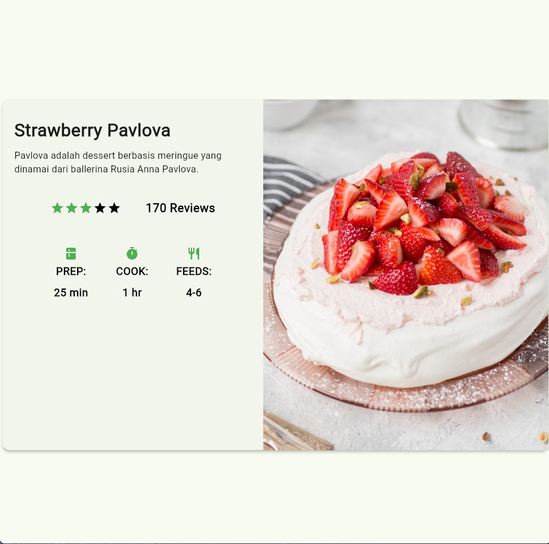

# Laporan Praktikum 6

 
Nama    : Rendha Putra Rahmadya
 
Kelas   : TI - 3E
 
NIM     : 2341720010
 
Absen   : 26

## Praktikum 1 : Layout dan Navigasi

Menambahkan 

Dengan hasil seperti berikut 

## Praktikum 2 : Implementasi Button Row

## Praktikum 3 : Implementasi text section
Penambahan text section 

## Praktikum 4 : Implementasi image section

## Tugas 1 : Implementasi flutter docs

## Praktikum 5 Membangun Navigasi di flutter

1. Membuat project baru bernama "belanja"
2. mengimplementasi go route untuk routing navigasi 
3. page home  

4. jika salah satu item ditekan maka akan masuk ke detail item
