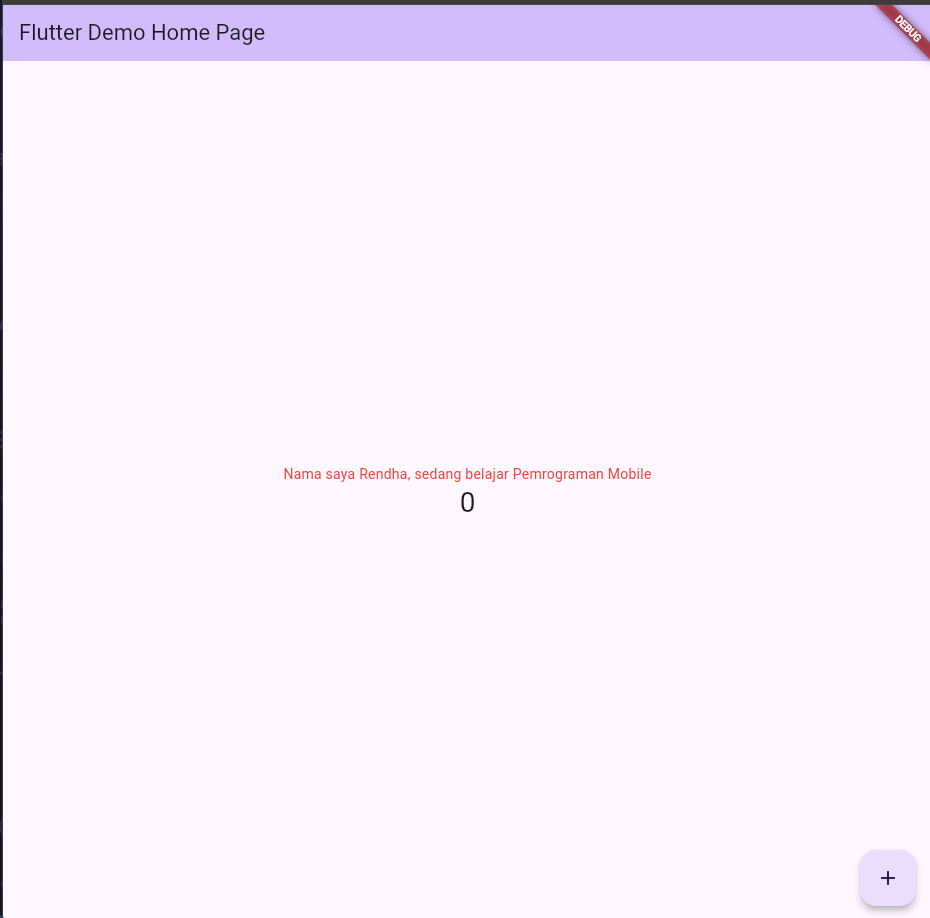
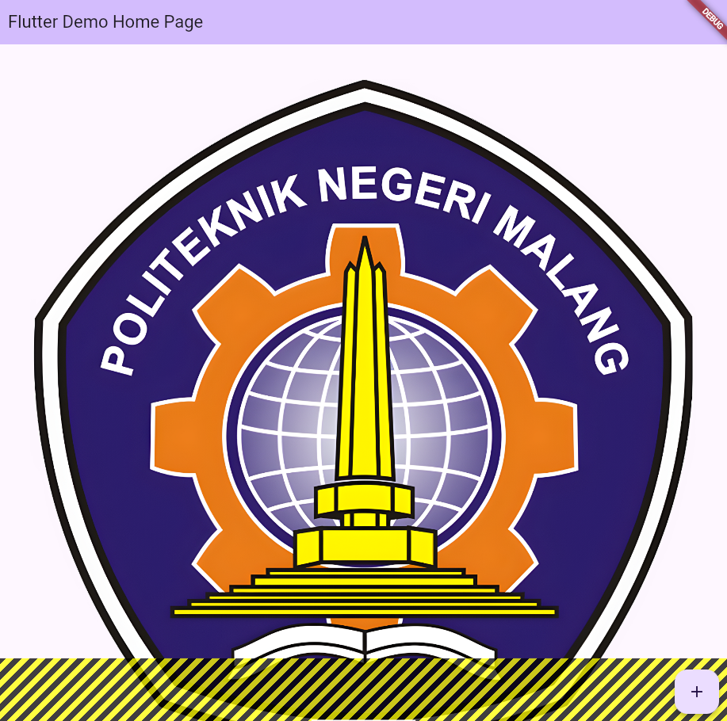
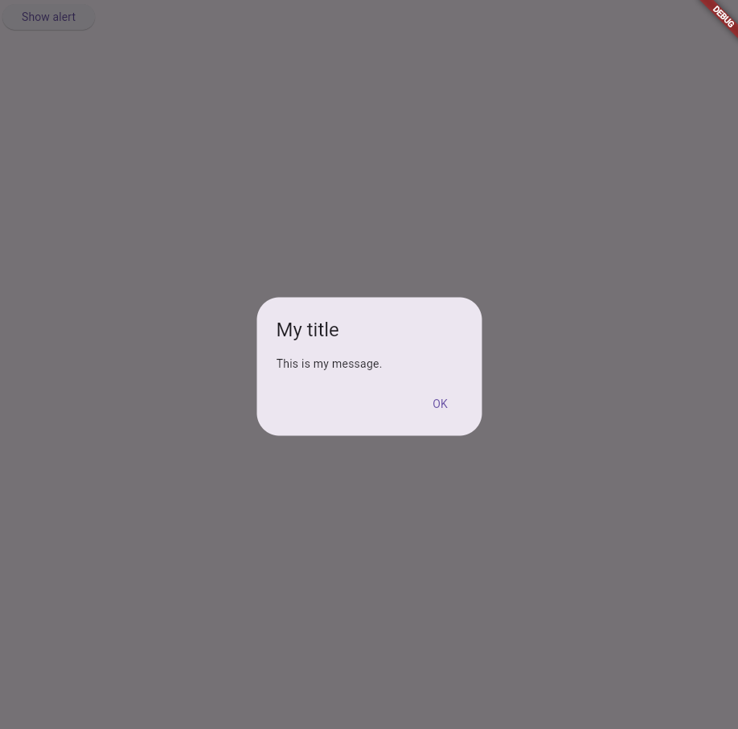
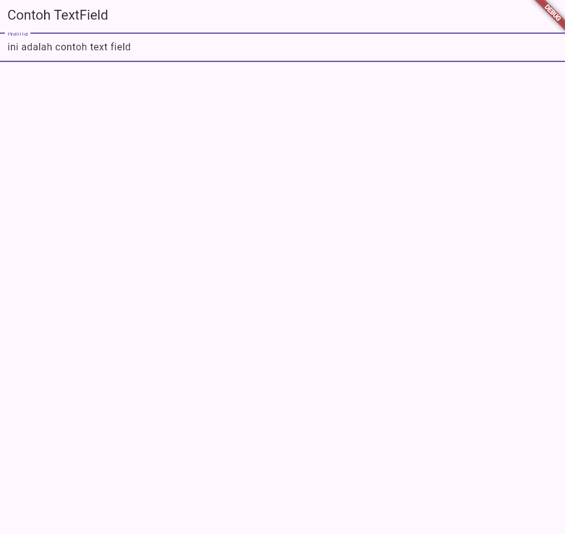
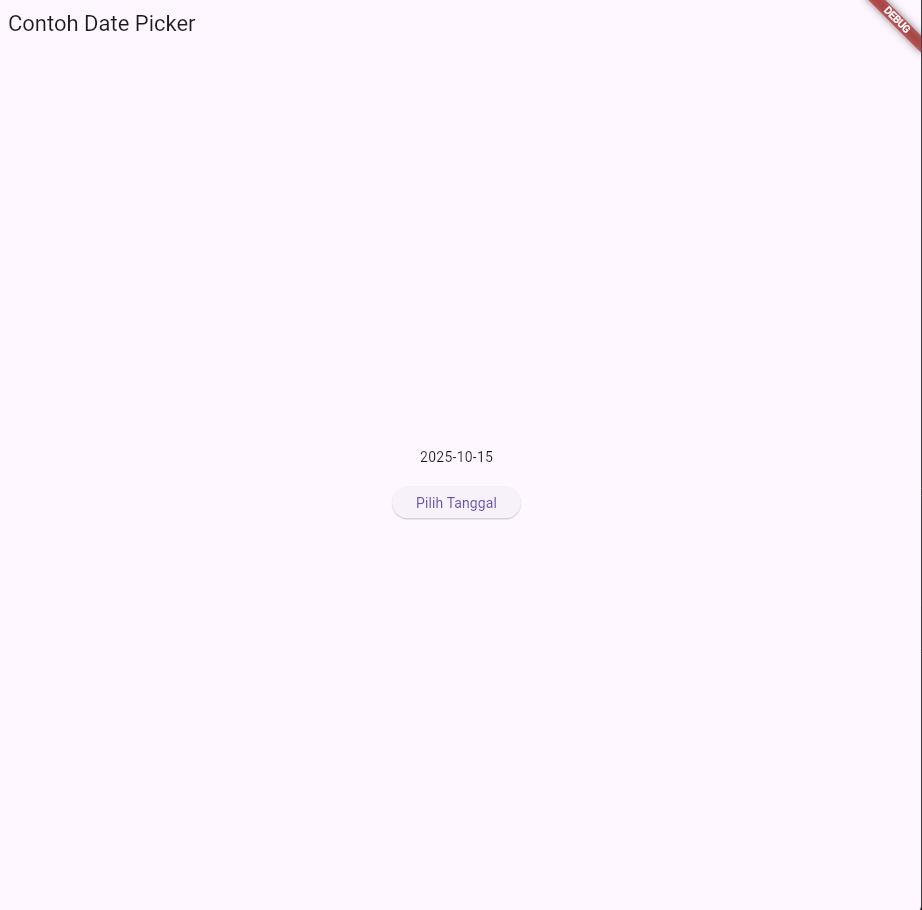

# Laporan Praktikum Jobsheet 5

Nama : Rendha Putra Rahmadya
NIM : 2341720010
Kelas : TI - 3E
No. Absen : 26

A new Flutter project.

## Praktikum 4 : basic widget

Menambahkan kode untuk basic image widget
 

## Praktikum 5 : Menerapkan Widget Material Design dan iOS Cupertino

Textfield  

DatePicker  

