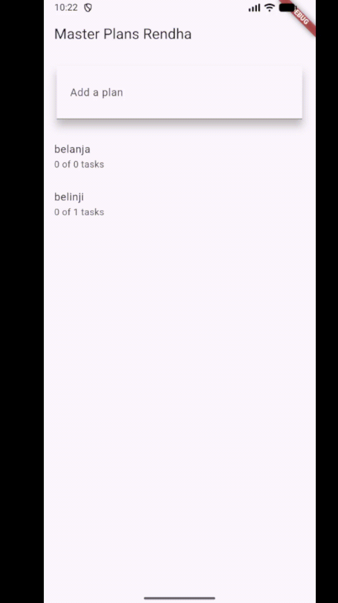

# jobsheet_9

<div align = 'center'>
 <br>
nama : Rendha Putra Rahmadya
<br> 
Kelas : TI-3E4
<br>
NIM : 2341720010
</div>

## Praktikum 1

1. Langkah 4 membuat file data_layer.dart sebagai barrel file yang berfungsi mengumpulkan dan mengekspor semua model data (plan.dart dan task.dart) dalam satu tempat. Dengan cara ini, ketika file lain membutuhkan model Plan dan Task, cukup melakukan satu kali import '../models/data_layer.dart' saja daripada harus import kedua file secara terpisah, sehingga membuat kode lebih ringkas, mudah dibaca, dan memudahkan maintenance ketika jumlah model bertambah banyak di masa depan.
2. Langkah 6 membuat tampilan utama aplikasi Master Plan dengan PlanScreen sebagai StatefulWidget yang menampilkan daftar tugas (tasks) dalam sebuah Plan. Class ini menggunakan Scaffold dengan AppBar untuk judul aplikasi, body yang memanggil _buildList() untuk menampilkan daftar tugas dalam bentuk ListView, dan FloatingActionButton melalui _buildAddTaskButton() untuk menambahkan tugas baru. State plan menyimpan data Plan yang berisi kumpulan tugas, dan karena menggunakan StatefulWidget, tampilan dapat diperbarui secara dinamis saat user menambah, mengedit, atau menyelesaikan tugas.
<br>

3. <br>
<div align = 'center'>

</div>

## Praktikum 2 
1. inherited widget memunkginkan data dapat diakses oleh semau widget children di bawahnya dalam widget tree tanpa perlu passing data melalui constructor secara manual. contoh seperti kode 
<br>
``` 
PlanProvider extends InheritedNotifier<ValueNotifier><Plan>>
```
<br>
berfungsi sebagai inheritedWidget yang menyimpan dan membagikan data Plan ke seluruh widget di bawahnya

2. Method completedCount menghitung jumlah task yang sudah selesai (complete = true) dalam list tasks, sedangkan completenessMessage menghasilkan pesan ringkas berupa jumlah task yang selesai dibandingkan total task, misal "2 out of 5 tasks". Cara ini memudahkan menampilkan progres penyelesaian tugas secara otomatis di UI tanpa perlu menghitung manual di setiap tampilan, sehingga kode lebih efisien, rapi, dan mudah digunakan ulang di berbagai bagian aplikasi.

3. <br> 
<div align = 'center'>

</div>
## Praktikum 3
1. Gambar tersebut menunjukkan bagaimana navigasi di Flutter bekerja menggunakan Navigator.push(), yaitu dengan menumpuk halaman (route) baru di atas halaman yang sedang aktif, bukan menggantinya. Pada sisi kiri (biru) ditampilkan widget tree halaman awal, sedangkan sisi kanan (hijau) adalah widget tree halaman tujuan setelah navigasi. Saat Navigator.push() dipanggil, Flutter membuat widget tree baru untuk halaman tujuan dan meletakkannya di atas stack Navigator, sementara widget tree halaman sebelumnya tetap ada di memori namun tidak dirender di layar. Karena MaterialApp dan provider berada di atas Navigator, konteks aplikasi dan state yang dibagikan tetap bisa digunakan oleh kedua halaman, dan ketika Navigator.pop() dipanggil, Flutter akan kembali menampilkan widget tree halaman sebelumnya tanpa membangunnya dari nol.
2.  <br>
<div align = 'center'>

</div>